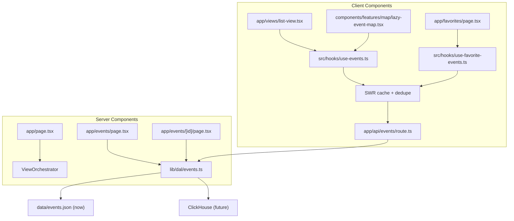

# Data Flow

## Goals

- Keep data source details out of UI components.
- Keep DAL imports server-only (`src/app/**`).
- Let client components fetch through thin Next.js API routes.
- Reuse cached client responses and dedupe parallel requests.

## Layers

- `src/lib/dal/events.ts`
  - Server-side data access layer.
  - Exposes `getEvents(...)` and `getEventById(...)`.
  - Current source: `src/data/events.json`.
  - Future source: ClickHouse (same API, different implementation).
- `src/app/api/events/route.ts`
  - Thin proxy for client components.
  - Calls DAL and returns JSON.
- `src/hooks/use-events.ts` and `src/hooks/use-favorite-events.ts`
  - Client data hooks powered by SWR.
  - Build request keys from Zustand state.
  - Use SWR cache for dedupe and revalidation.
- UI
  - Server components: may import DAL directly.
  - Client components: use SWR hooks that call `/api/events`; must not import DAL.

## Client Caching

- SWR handles client-side cache, deduplication, and revalidation for `/api/events` requests.
- `SWRConfig` is registered in `src/app/components/providers.tsx` with a shared fetcher from `src/lib/fetcher.ts`.
- Reused keys (`/api/events?...`) share one request and one cache entry across list/map/favorites views.

## Runtime Paths

## Guardrail

- ESLint blocks DAL imports from `src/components/**`, `src/hooks/**`, and `src/stores/**`.
- Error message instructs client code to use `/api/events`.
